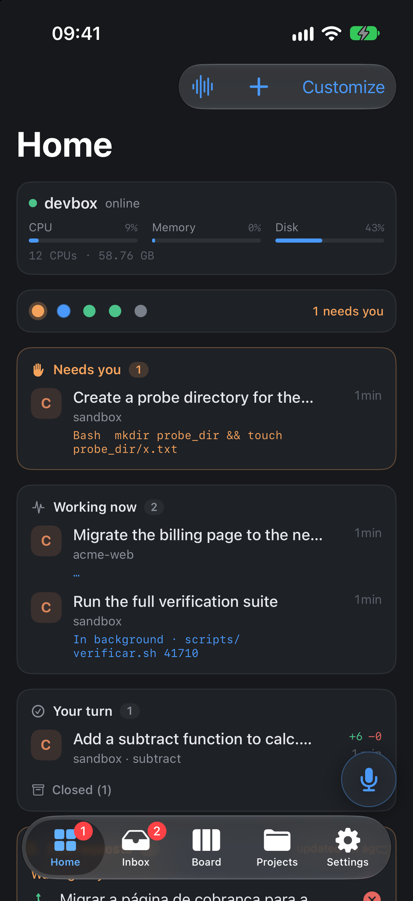
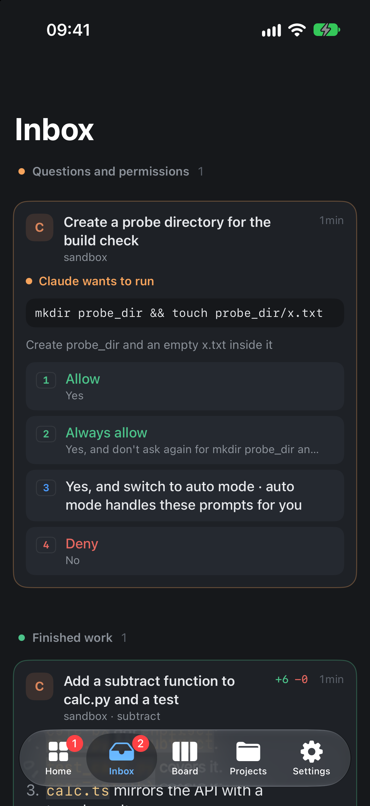
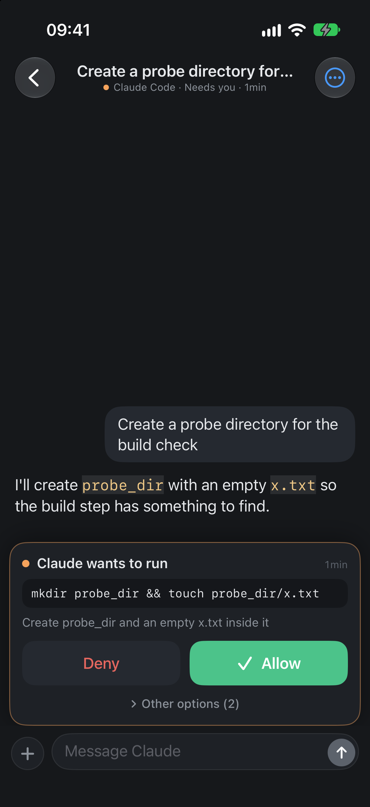
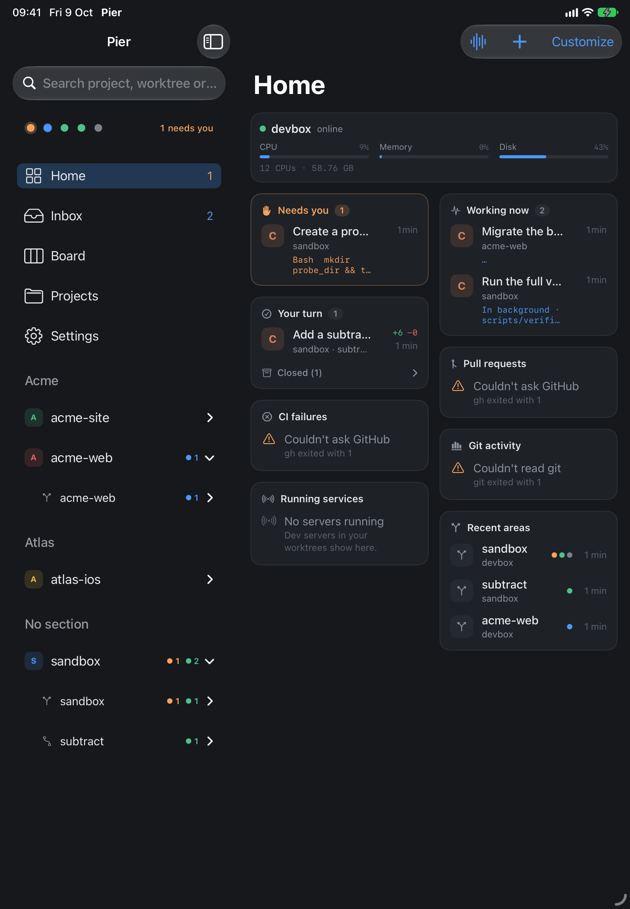
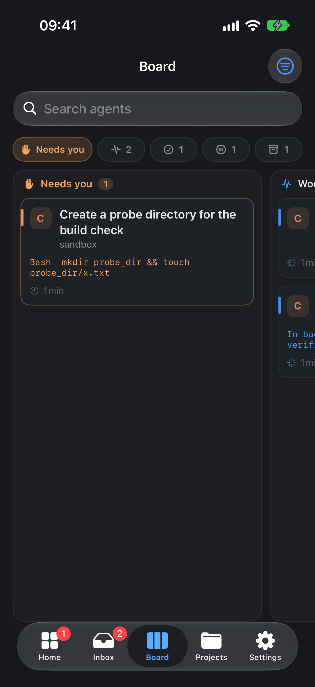
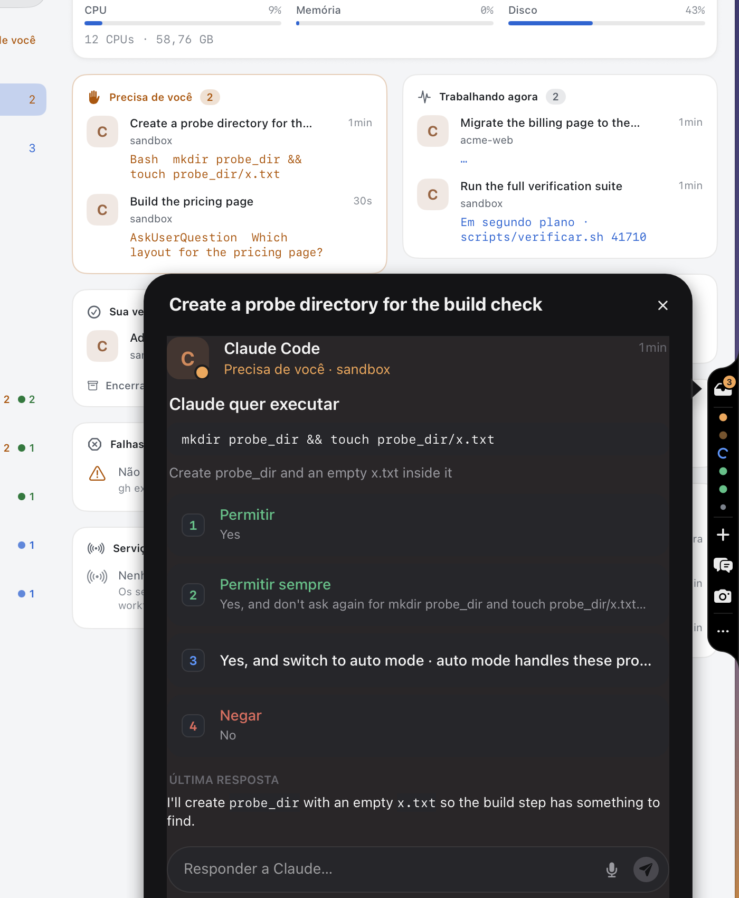
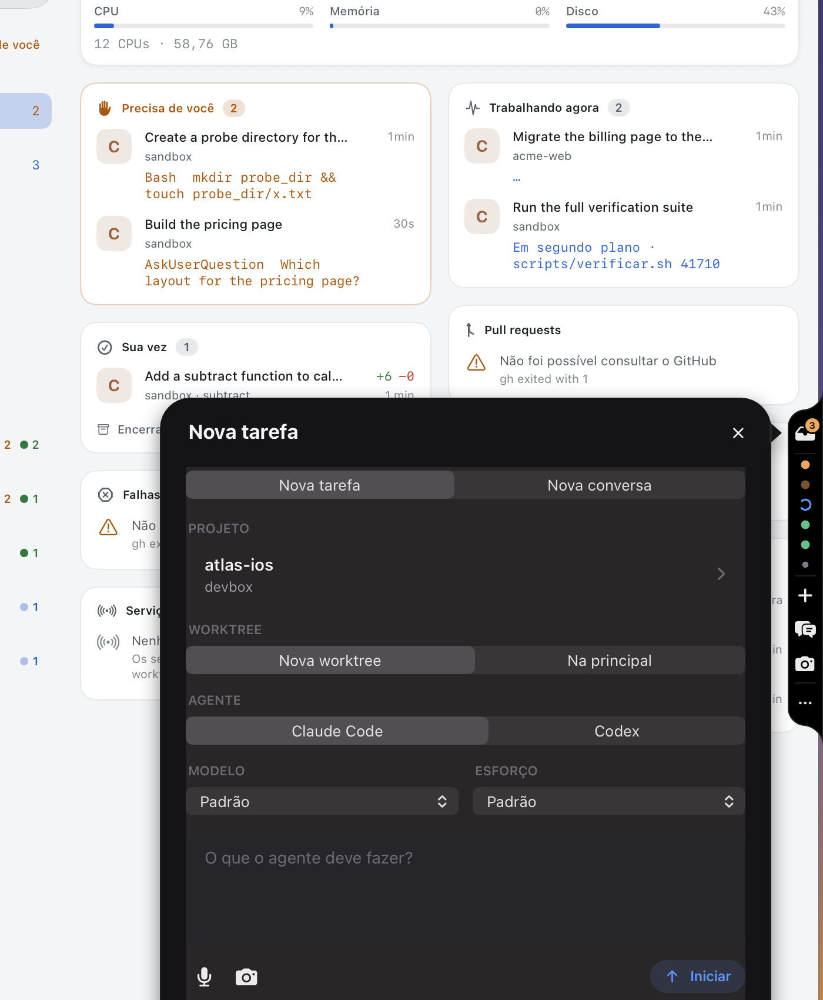

# Pier

**Your coding agents, in your pocket.** Pier is a native app for iPhone, iPad and Mac that lets you watch and drive the
coding agents (Claude Code, Codex) running on your development boxes — and **pierd**, the small server each box runs.

Agents ask; you answer in a tap or a keystroke, from anywhere. No agent sits waiting.

<p align="center">
  
  
  
</p>
<p align="center">
  
  
</p>
<p align="center">
  
  
</p>

## What it does

- **Every agent, every box, live.** One Home with who needs you, who is working and whose turn it is, plus status dots,
  pull requests, CI failures, git activity and running dev servers. The **Board** (kanban) groups every agent by state.
- **Inbox, keyboard first.** Every agent's questions and finished work in one list. Press `1` `2` `3` to answer,
  `J`/`K` to move, `E` to archive. Finished turns come with up to two **suggested next steps**, ready to send.
- **Answer anything.** Permission prompts (Allow / Always / Deny), multiple-choice questions, plan approvals and the
  agents' own startup dialogs become buttons. Every answer waits two seconds with **Undo** (or `Esc` / `⌘Z`).
- **Talk.** Say or type what you need; Pier picks the agent already on that work (or starts a new task), shows you the
  decision, and only then sends it — with a receipt.
- **A chat per session.** The transcript folded into turns, Markdown replies, diffs, background jobs and subagents, and
  the raw terminal one tap away.
- **Chats with no project.** Start Claude Code or Codex in a folder of its own to ask something, talk an idea through
  or plan something that does not exist yet (`⇧⌘N`).
- **Review and ship.** Changed files and diffs, commit / push / open a PR with an AI-written message, and a full
  **pull request** screen: checks, reviews, conversation, diffs, merge, comment, approve — or bring someone's PR into a
  worktree and continue it with an agent.
- **Keep the box tidy.** Ending a session can remove its worktree, stop its dev servers and fast-forward `main`;
  **Faxina** (cleanup) does it for the whole box, and can run daily from Shortcuts.
- **Notifications that carry the answer.** Push notifications with the agent's last reply (or a one-line AI recap);
  a question arrives with its choices as buttons, so it is answered from the Lock Screen; Live Activities on the Lock
  Screen and Dynamic Island, and Home Screen widgets.
- **The box needs you too.** A signed-out agent, missing hooks, a box out of reach: the Inbox says so, with the command
  to run.
- **One box, several people.** Each person runs their own pierd as their own user, with a box name and a range of
  dev-server ports of its own (`pierd install --name … --ports …`).
- **Made for each device.** Tabs on iPhone; sidebar, command palette (`⌘K`) and menu shortcuts on iPad and Mac; light
  and dark.
- **Always there on the Mac.** A narrow black tab hanging from the edge of the screen, over every app: a dot per agent
  (working, needs you, done); under the pointer it grows, Dock-like, into the Inbox, the agents, a new task, Talk and
  "point at it". Beside it, a dark panel with the app's work without the app's window: answer the Inbox with `1` `2` `3`
  (Esc undoes), read an agent's last reply and send it a next step, start a task or a chat, mark a part of the screen and
  say what should happen. Double-tap `⌥` (or `⌃⌥Space`) opens Talk from anywhere, `⌃⌥P` hides and shows the tab; desktop
  widgets too, and a menu bar item for those who hide the tab.

The AI touches (titles, recaps, commit messages, next steps, routing) run as `claude -p --model haiku` **on your box**,
with the subscription that is already there. The app holds no API keys.

## How it works

```
 iPhone / iPad / Mac                         your dev box (Linux)
┌──────────────────────┐   mutual TLS 1.3   ┌───────────────────────────────────────────┐
│ Pier app             │ ─── Ed25519 ─────▶ │ pierd                                     │
│  PierKit (Swift)     │   HTTP/2, /v1 API  │  sessions in tmux · Claude Code / Codex   │
│  pinned box key      │ ◀── event stream ─ │  hooks · transcripts · git worktrees ·    │
└──────────────────────┘                    │  dev servers (systemd) · exec · push      │
           ▲                                └───────────────────────────────────────────┘
           └──────────────── APNs (alerts, Live Activities, widgets) ◀── pierd
```

- The app pairs with each box once, by scanning a QR code or pasting a `pier://` link. After that it talks to the box
  directly: no account, no relay, no cloud. The box's key is pinned; each device has its own key and can be revoked.
- pierd runs agents in tmux, knows each agent's state from the agents' own hooks, reads their conversations, manages
  git worktrees and their dev servers, and sends push notifications through your own APNs key.

## Requirements

- **Box:** Linux (x86-64 or arm64) with git, tmux, systemd (user units) and the agent CLIs you use (Claude Code, Codex),
  signed in. `gh` for the pull request features.
- **App:** Xcode 26 or newer, [XcodeGen](https://github.com/yonaskolb/XcodeGen); iOS/iPadOS 17+, macOS (Mac Catalyst).
- **Server build:** Go 1.25+ (standard library only).

## Getting started

### 1. Run pierd on your box

```sh
cd Server/pierd
GOOS=linux GOARCH=amd64 CGO_ENABLED=0 go build -trimpath -o pierd ./cmd/pierd
scp pierd you@devbox:~/.local/bin/

# on the box, as the user your agents run as:
pierd install --listen <box-ip>:7444     # systemd user service + agent hooks
sudo loginctl enable-linger $USER         # keep it running after logout
pierd location add web ~/code/web         # the repositories the app should see
pierd pair                                # prints a single-use pier:// link and its QR code
```

More in [`Server/pierd/README.md`](Server/pierd/README.md) (configuration, services, hooks).

### 2. Build the app

```sh
brew install xcodegen
cp Config/Signing.example.xcconfig Config/Signing.xcconfig   # your DEVELOPMENT_TEAM and PIER_BUNDLE_ID
xcodegen generate
open Pier.xcodeproj
```

Every identifier (bundle ids, App Group, keychain groups, APNs topic) derives from `PIER_BUNDLE_ID`. Simulator builds
need no signing. For daily use on a device, build **Release** (Debug runs the TLS stack unoptimised):

```sh
xcodebuild -project Pier.xcodeproj -scheme Pier -configuration Release \
  -destination 'generic/platform=iOS' -allowProvisioningUpdates build
```

The Mac app is the same target as Mac Catalyst (`-destination 'platform=macOS,variant=Mac Catalyst'`).

Open the app, scan the QR code from `pierd pair` (or paste the link), and your agents appear. A paired device can invite
another one from Settings → *Take it to iPhone*.

### 3. Push notifications (optional)

Create an APNs auth key (`.p8`) in your Apple Developer account, then on the box put it at
`~/.config/pier/AuthKey.p8` (mode 0600) and write `~/.config/pier/push.json`:

```json
{ "key_id": "ABC123DEFG", "team_id": "TEAMID1234", "bundle_id": "<your PIER_BUNDLE_ID>" }
```

Restart pierd (`systemctl --user restart pierd`). The app registers by itself. Details in [`docs/PUSH.md`](docs/PUSH.md).

## Security

- Mutual TLS 1.3 with Ed25519 on both sides; the app pins the box's public key, the box only answers paired clients.
- Pairing links are single use and expire in 10 minutes; `pierd clients` / `pierd revoke` manage devices.
- pierd listens only on the address you give it (or your tailnet address by default) — keep it off the public internet;
  a VPN such as Tailscale is the easy way to reach a box from anywhere.
- Commands that the app builds for the box (`exec`) pass user text base64-encoded, never interpolated into the shell.

Found a problem? Please open an issue (or a private advisory for anything sensitive).

## Development

```sh
cd Packages/PierKit && swift test                      # the Swift kit: transport, pairing, API, parsers
cd Server/pierd && go vet ./... && go test ./...       # the server
xcodebuild test -project Pier.xcodeproj -scheme Pier \
  -destination 'platform=iOS Simulator,name=iPhone 17' # UI tests against an in-memory mock box
```

`-uiTestMock 1` swaps every paired box for an in-memory one (`App/Debug/UITestMock.swift`): handy for UI work without a
server. `docs/ARCHITECTURE.md` lists the other launch arguments.

| Path | What |
|---|---|
| `App/` | the SwiftUI app (Core, DesignSystem, Features/*) |
| `Extensions/PierWidgets`, `Mac/PierMenuBar` | widgets (iPhone, iPad, Mac desktop) + Live Activities; the Mac's menu bar item, edge tab, toolbar and Inbox card |
| `Packages/PierKit` | transport (swift-nio-ssl), identity, pairing, typed API, models, parsers |
| `Server/pierd` | the box server (Go) |
| `Tools/pierctl` | a command-line client for end-to-end checks |
| `Vendor/swift-nio-ssl` | swift-nio-ssl with a small TLS-exporter patch used by pairing |
| `docs/` | [architecture](docs/ARCHITECTURE.md), [protocol](docs/PROTOCOL.md), [API](docs/API.md), [push](docs/PUSH.md) |

The UI speaks Brazilian Portuguese and English (String Catalogs); translations are welcome.

## Credits

- Third-party notices for pierd are in [NOTICE](NOTICE).
- [swift-nio-ssl](https://github.com/apple/swift-nio-ssl) and [SwiftNIO](https://github.com/apple/swift-nio) (Apache 2.0).

## License

MIT — see [LICENSE](LICENSE) and [NOTICE](NOTICE).
